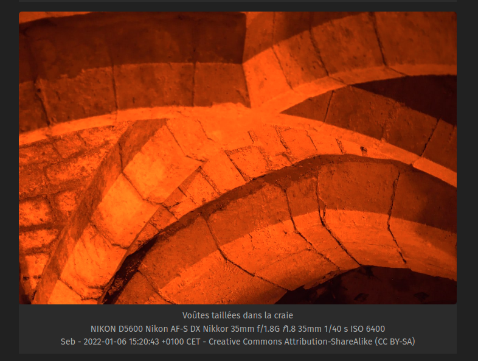
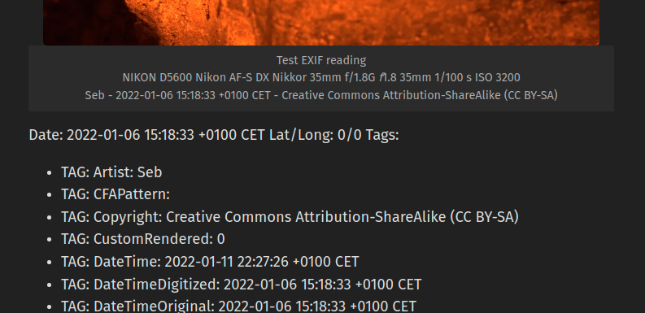

# Display pictures with EXIF Metadata

## Usage

This shortcode will convert `` into this :

```html
<figure>
<a href="image.permalink"></a>
    <figcaption class="exif"> My Picture
        <br />CameraModel LensModel ApertureValue FocalLength ExposureTime ISOValue
        <br />ArtistName - PictureDateTime - CopyrightLicense
    </figcaption>
{{end }}
</figure>
```

Options :

- `alt` : display the alternative text and caption
- `resize` : give the resize value for the thumbnail, as `<int>x`. Ex : `480x`. Default is `720x`.

Example :

```golang

```

Will render :



A second shortcode is also available for debugging purpose and will render all available tags into a list.

``

Will render :



## Install

### Shortcode

Copy the content of the `shortcodes/` folder into on of these folders (order by Hugo's precedence):

1. `/layouts/shortcodes/exif.html`
2. `/themes/YOURTHEME/layouts/shortcodes/exif.html`

### Partials

Copy the content of the `partials/` folder into on of these folders (order by Hugo's precedence):

1. `/layouts/partials/format-exposure-time.html`
2. `/themes/YOURTHEME/layouts/partials/format-exposure-time.html`

## Showcase

- [Visite d'une case de Champagne](https://blog.zedas.fr/posts/visite-cave-champagne/) : The Blog article that made me writing this shortcode

If you want to display your shortcode usage in this showcase, feel free to open a Pull Request on this file or [contact me](https://blog.zedas.fr/contact/).

