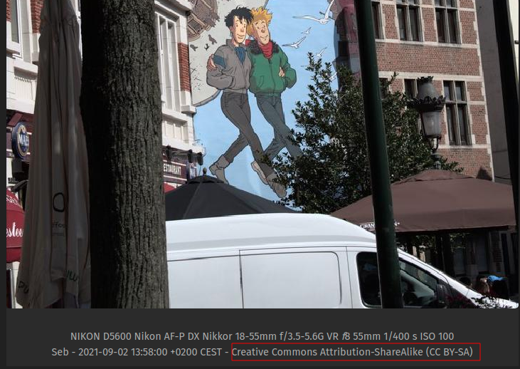
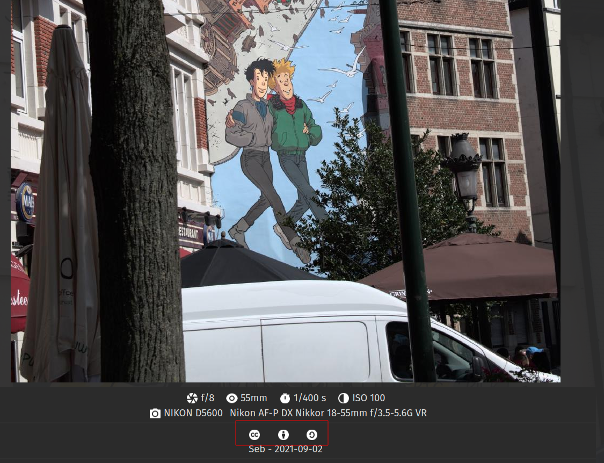

# Transform Creative Commons mark into graphical icons

## Purpose

This partial will transform a Creative Commons license mark into graphical icons.

Example : with my Exif shortcode I get this result :



The Partial will transform it into this :



## Usage

Call into your templates like with :

```go
{{ partial "format-creative-commons.html" "Creative Commons Attribution-ShareAlike-NonCommercial (CC BY-SA-NC)" }}
```

Or you can pass the value as a context :

```go
{{ partial "format-creative-commons.html" . }}
```

## Install

### Icons

Copy the content of the `assets/` folder into one of these folders (order by Hugo's precedence):

1. `/assets/icons`
2. `/themes/YOURTHEME/assets/icons`

### Partial

Copy the content of the `partials/` folder into on of these folders (order by Hugo's precedence):

1. `/layouts/partials/format-creative-commons.html`
2. `/themes/YOURTHEME/layouts/partials/format-creative-commons.html`

## Showcase

- Currently working on a Photo Blog, comming soon ;)

If you want to display your shortcode usage in this showcase, feel free to open a Pull Request on this file or [contact me](https://blog.zedas.fr/contact/).

## Other informations

The Creative Commons formater partial uses [Remix Icons](https://github.com/Remix-Design/remixicon) which are available under Apache License 2.0.
