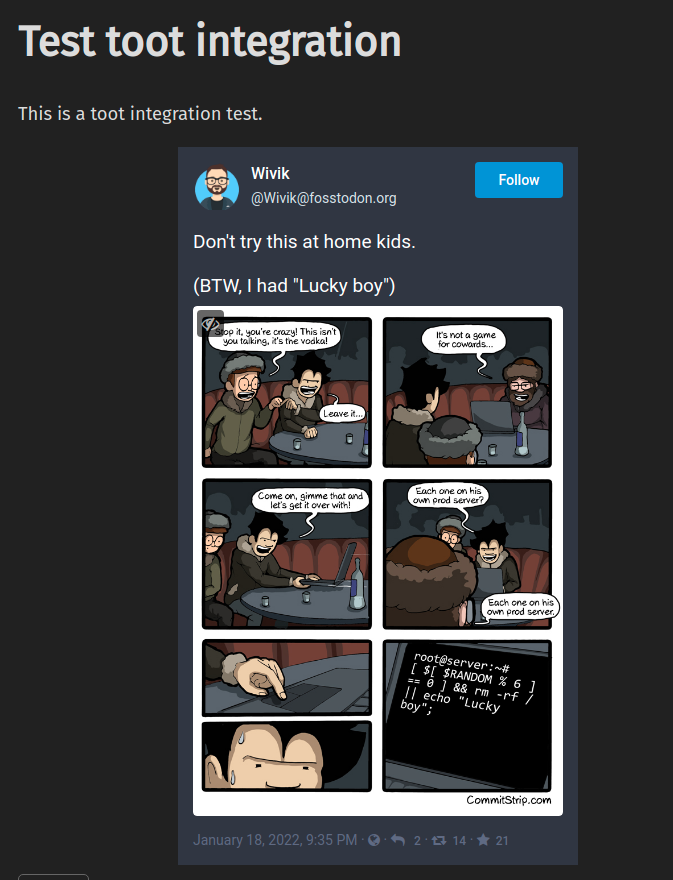

# Mastodon Toot integration

## Purpose

This shortcode will convert `` into this :

```html
<div style="text-align:center;">
<iframe src="{{ $link }}/embed" class="mastodon-embed" style="max-width: 100%; border: 0" width="400" allowfullscreen="allowfullscreen"></iframe><script src="https://mastodon.instance/embed.js" async="async"></script>
</div>
```

Example :

```golang

```

Will render :



